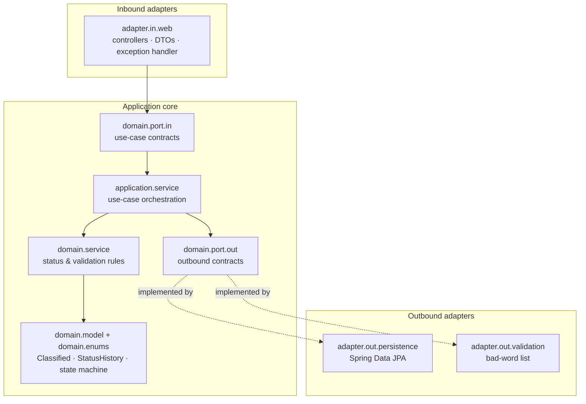
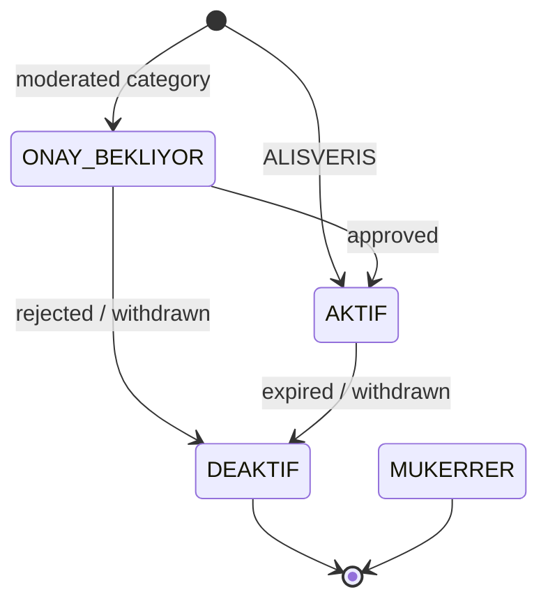

# Classified Lifecycle API

[](https://github.com/tahayvz/classified-lifecycle-api/actions/workflows/ci.yml)
[](https://github.com/tahayvz/classified-lifecycle-api/actions/workflows/codeql.yml)
[](https://openjdk.org/projects/jdk/17/)
[](https://spring.io/projects/spring-boot)
[](LICENSE)

A Spring Boot service for the lifecycle of classified listings: creating them, moving them
through an explicit status state machine, recording every transition, and exposing aggregate
dashboard statistics.

The point of the project is the **boundary discipline**. Business rules live in a core that
knows nothing about HTTP, JPA or Spring, and that separation is enforced by
[ArchUnit tests](src/test/java/com/marketplace/classifieds/architecture/HexagonalArchitectureTest.java)
that fail the build when a dependency points the wrong way.

---

## Architecture

Hexagonal (ports & adapters). Dependencies point inward: adapters know the core, the core
never knows its adapters.



Enforced by ArchUnit:

| Rule | Why |
| --- | --- |
| `domain` must not depend on `org.springframework` | rules stay runnable without a Spring context |
| `domain.model` / `service` / `enums` / `port.out` must not depend on `adapter` | the core must not know how it is delivered or stored |
| `domain` must not depend on `application` | dependencies point inward only |
| `adapter.in` must not depend on `adapter.out` | adapters talk through ports, never to each other |
| `application` must not depend on `adapter.out` | use cases depend on contracts, not implementations |
| everything in `domain.port` must be an interface | a port is a contract |
| Spring Data types must not escape `adapter.out.persistence` | persistence stays replaceable |

---

## Lifecycle state machine

Transitions are declared on `ClassifiedStatus` and validated by `ClassifiedStatusService`
before anything is written. All 16 from/to combinations are covered by a
[parameterised test matrix](src/test/java/com/marketplace/classifieds/domain/enums/ClassifiedStatusTest.java).



`DEAKTIF` and `MUKERRER` are terminal. Rejected transitions leave both the listing and its
history untouched — a rejection is never half-applied.

---

## Business rules

| Rule | Detail |
| --- | --- |
| Title | 10–50 characters, must start with a letter or digit |
| Description | 20–200 characters |
| Category | `EMLAK`, `VASITA`, `ALISVERIS`, `DIGER` |
| Initial status | `ONAY_BEKLIYOR`, except `ALISVERIS` which starts `AKTIF` |
| Expiry | `EMLAK` 4 weeks · `VASITA` 3 weeks · `ALISVERIS` 8 weeks · `DIGER` 8 weeks |
| Banned words | title and description are checked against `Badwords.txt` |
| Duplicates | same title + description + category is rejected with `409 Conflict` |
| Immutability | a `MUKERRER` listing cannot change status |
| History | every accepted transition is recorded with actor and reason |

---

## API

Base path `/api/v1`.

| Method | Path | Purpose | Success |
| --- | --- | --- | --- |
| `POST` | `/api/v1/classifieds` | Create a listing | `201` |
| `GET` | `/api/v1/classifieds/{id}` | Fetch a listing | `200` |
| `PUT` | `/api/v1/classifieds/{id}/status` | Change status | `200` |
| `GET` | `/api/v1/classifieds/{id}/history` | Transition history, newest first | `200` |
| `GET` | `/api/v1/dashboard/statistics` | Counts per status plus total | `200` |
| `GET` | `/actuator/health` | Health probe | `200` |

Error responses:

| Status | Raised when |
| --- | --- |
| `400` | bean validation failure, unreadable body, banned word |
| `404` | listing does not exist |
| `409` | duplicate listing, invalid transition, unchanged status, immutable listing |

### Example

```bash
curl -X POST http://localhost:8080/api/v1/classifieds \
  -H 'Content-Type: application/json' \
  -d '{
        "title": "Satilik bahceli daire",
        "description": "Merkezi konumda, genis ve ferah, otoparkli daire ilani",
        "category": "EMLAK"
      }'
```

```bash
curl -X PUT http://localhost:8080/api/v1/classifieds/1/status \
  -H 'Content-Type: application/json' \
  -d '{ "status": "AKTIF", "reason": "approved by moderator" }'
```

Interactive documentation: `http://localhost:8080/swagger-ui/index.html`

---

## Testing

The suite is split so the fast tests stay fast and the slow ones stay honest.

| Layer | Count | What it proves | Needs Docker |
| --- | --- | --- | --- |
| Domain unit tests | 45 | state machine matrix, expiry and approval defaults, transition guards | no |
| Application unit tests | 14 | use-case orchestration against mocked ports | no |
| Web slice tests | 27 | controller contracts, status codes, error mapping | no |
| Persistence tests | 10 | real JPA mapping, grouped counts, history ordering | no |
| Architecture tests | 9 | the boundaries above, as executable rules | no |
| Adapter & bootstrap tests | 7 | bad-word loading, timing aspect, context startup | no |
| Integration tests | 10 | full HTTP → PostgreSQL lifecycle via Testcontainers | yes |

```bash
./gradlew test                 # 112 unit and slice tests, no Docker required
./gradlew integrationTest      # end-to-end against a real PostgreSQL container
./gradlew check                # both, plus the coverage gate
```

Coverage is a build gate, not a badge: the build fails below **90% instruction coverage
overall** and **100% branch coverage in `domain`**. Current: 98.1% instruction, 97.7% line,
90.0% branch.

---

## Running it

```bash
./gradlew bootRun              # http://localhost:8080, H2 in memory
```

```bash
docker compose up --build -d   # containerised, health-checked
docker compose logs -f classified-lifecycle-api
docker compose down
```

H2 is the default so the service starts with no dependencies. Integration tests run against
PostgreSQL 16 to keep the JPA mapping honest against a real database.

---

## Tech

Java 17 · Spring Boot 3.5 · Spring Web · Spring Data JPA · Bean Validation · Actuator ·
springdoc OpenAPI · Lombok · Gradle (Kotlin DSL) · H2 · PostgreSQL · JUnit 5 · Mockito ·
AssertJ · ArchUnit · Testcontainers · JaCoCo · Docker · GitHub Actions

---

## Known limitations

Kept explicit rather than hidden, since they are design trade-offs rather than oversights:

- **`MUKERRER` is currently unreachable.** Duplicate submissions are rejected with `409`
  instead of being stored and flagged, so no listing ever enters that state. The status and
  its immutability guard exist for the flagging workflow, which is not implemented yet.
- **Inbound ports carry web DTOs.** `domain.port.in` references request and response types
  from `adapter.in.web.dto`, which is why the ArchUnit boundary rule covers the domain core
  rather than the whole `domain` package. Introducing dedicated command and result types is
  the next refactor.
- **Error bodies are ad-hoc JSON**, not RFC 7807 `application/problem+json`.
- **No authentication.** The status endpoint records a hard-coded `system` actor.
- **Schema is generated by Hibernate** (`ddl-auto`), with no migration tool.

## License

MIT — see [LICENSE](LICENSE).
